> 현재 이 프로젝트는 종료되었으므로, 코드를 공개합니다. (데이터베이스 삭제됨)

# Eco-ing

> 환경을 위한 움직임 ― 에코잉

---

## 프로젝트 개요

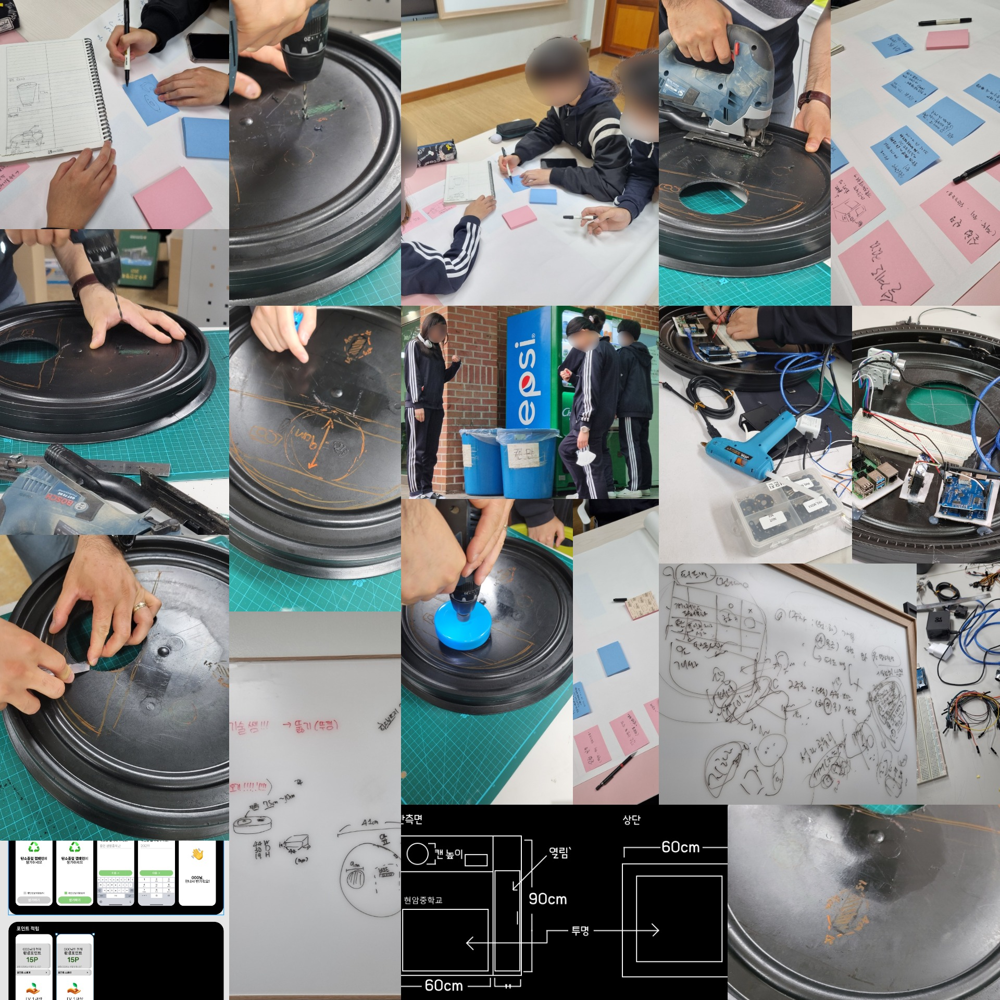

[링크](eco-ing.vercel.app)

이 프로젝트는 아두이노 우노 R3와 라즈베리파이를 활용하여 환경 포인트 시스템을 구축하는 것입니다. 사용자가 쓰레기를 분리배출할 때 포인트를 적립할 수 있는 시스템을 개발합니다. 서버는 Vercel에서 호스팅되며, GitHub을 통해 버전 관리를 합니다.

<details>
<summary><h2>사용 화면 (예시)</h2></summary>

<div style="overflow-x: auto; white-space: nowrap; padding: 10px 0;">
  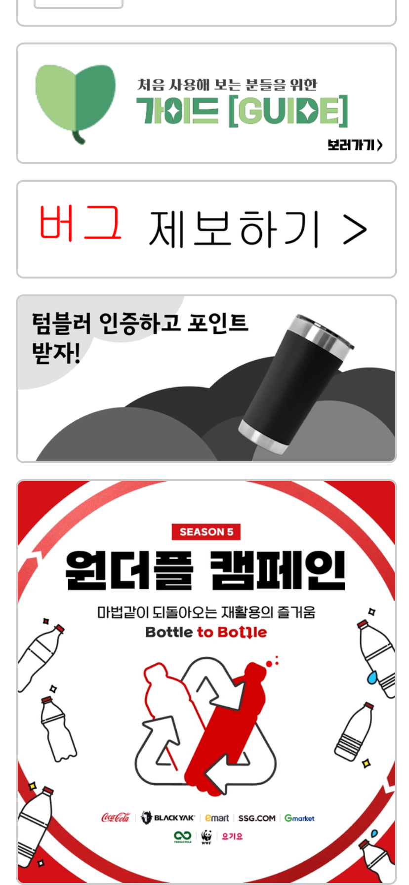
  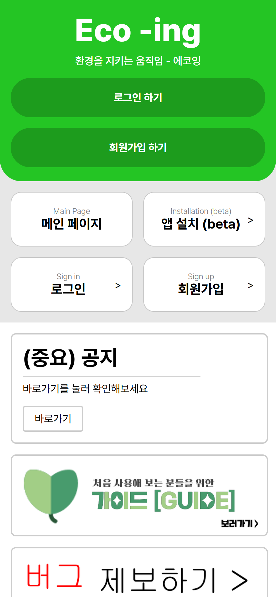
  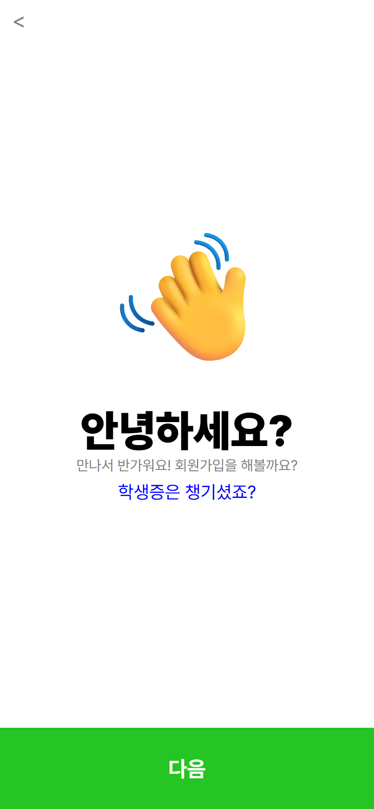
  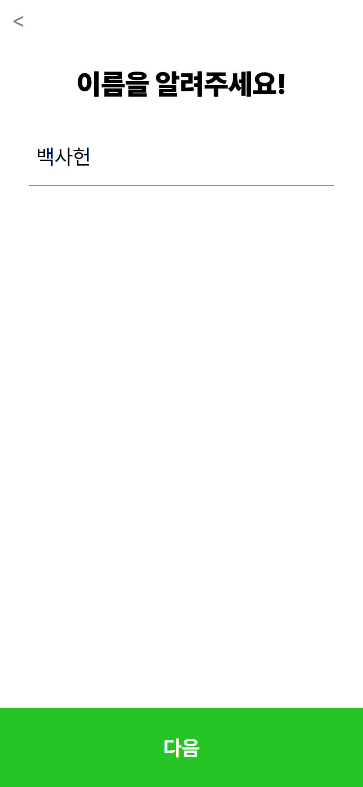
  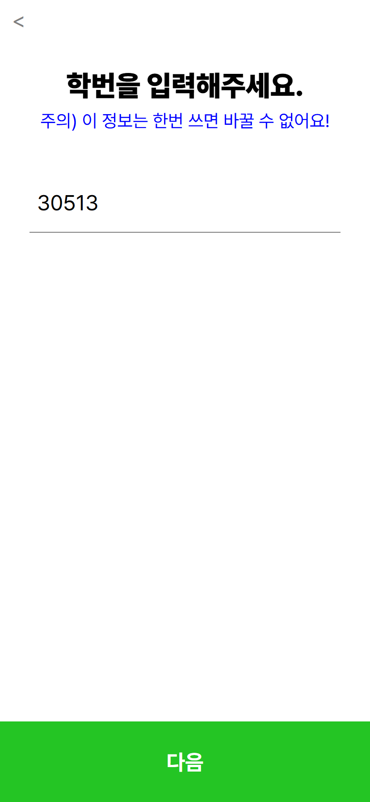
  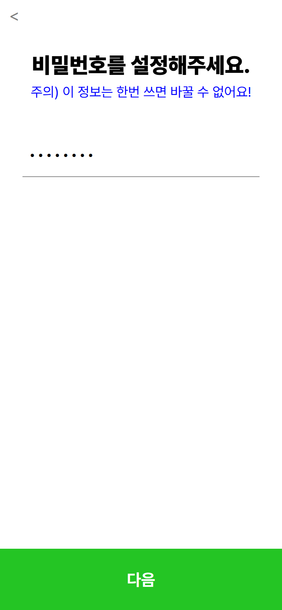
  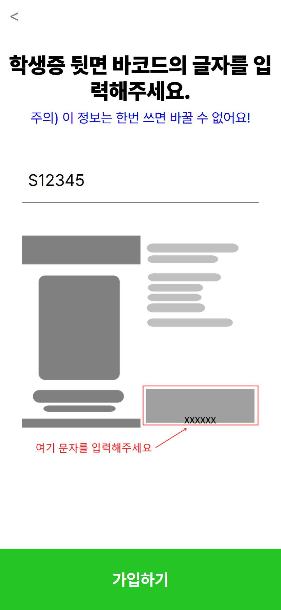
  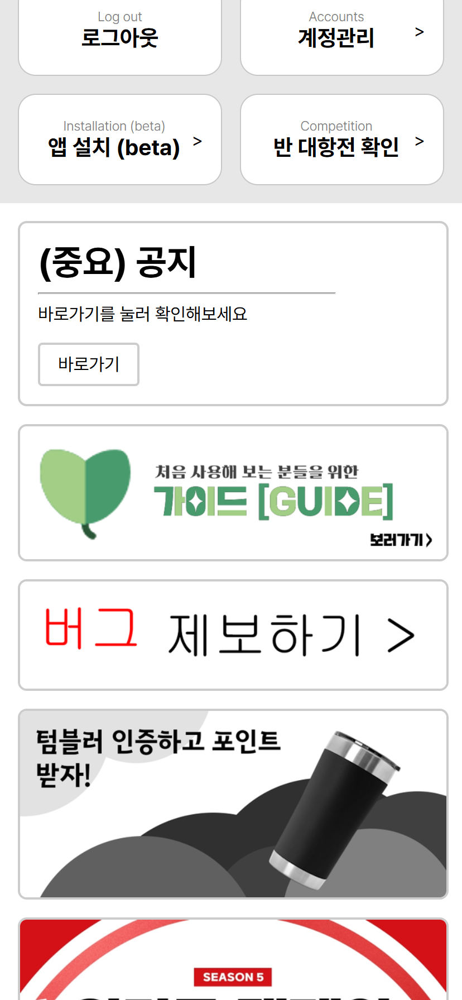
  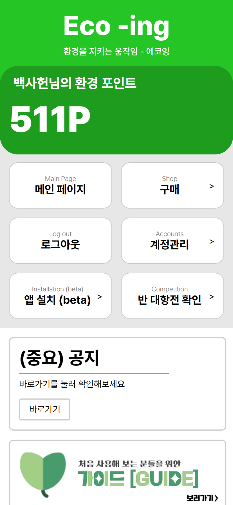
  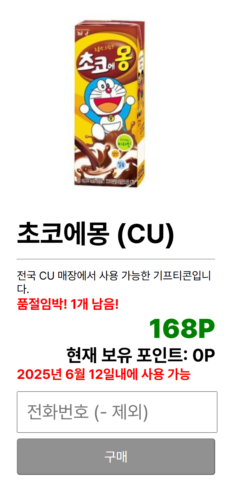
  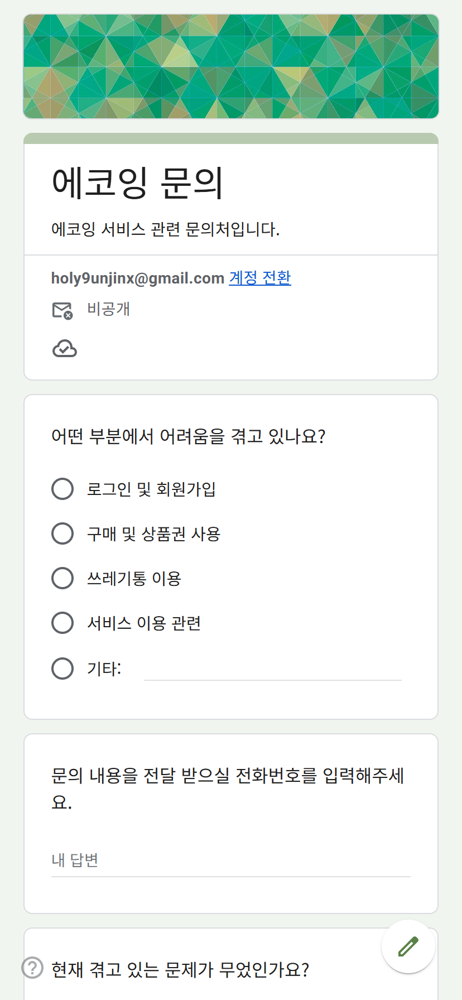
  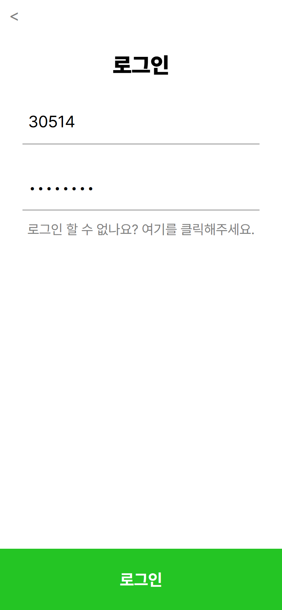
    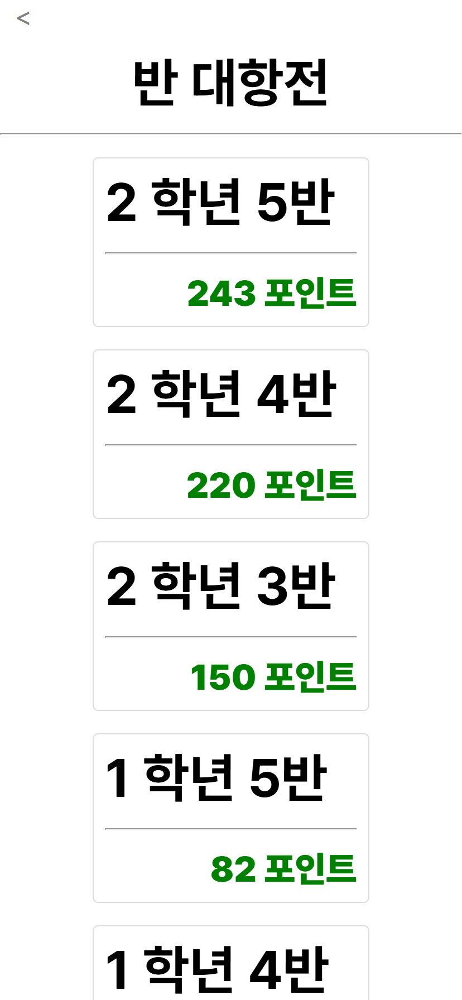
  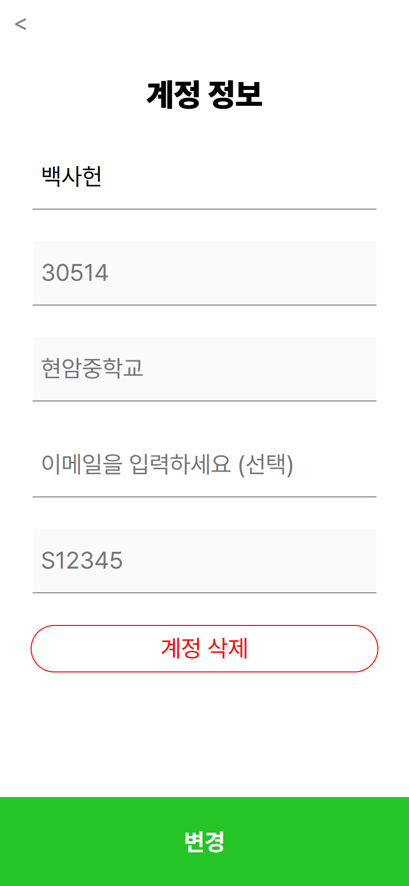
  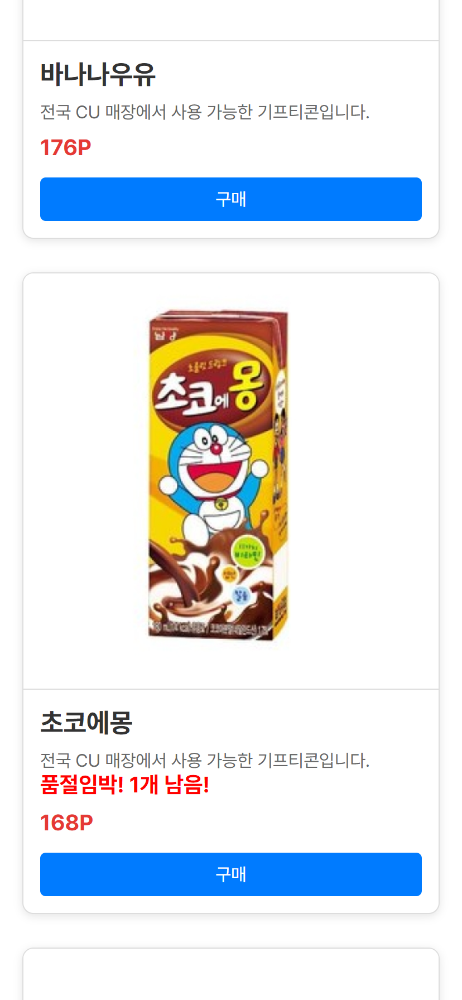
</div>
</details>


## 기술 스택

- **프론트엔드**: SvelteKit
- **백엔드**: Node.js, Express.js
- **데이터베이스**: SQLite, Cloud Firestore (선택 사항)
- **하드웨어**: Arduino Uno R3, Raspberry Pi
- **서버 호스팅**: Vercel
- **버전 관리**: GitHub

## 하드웨어 설정

1. 아두이노 우노 R3와 라즈베리파이를 연결합니다.
2. 아두이노에서 센서를 통해 데이터를 수집하여 라즈베리파이로 전송합니다.
3. 라즈베리파이는 수신된 데이터를 처리하여 서버로 전송합니다.

## 소프트웨어 설정

### 1. 클론 프로젝트

```bash
git clone https://github.com/holy0unjinx/eco-ing.git
```

### 2. ENV 파일 제작

```env
DATABASE_URL={데이터베이스 URL 넣기}
```

### 3. 디벨롭 서버 열기

```bash
bun install
bun run dev
```

## 사용 방법 (실물)

1. 아두이노와 라즈베리파이를 설정하고 전원을 켭니다.

2. 프론트엔드 서버와 백엔드 서버를 시작합니다.

3. 웹 브라우저에서 프론트엔드 URL을 열어 사용자 인터페이스에 접근합니다.

4. 쓰레기를 올바르게 분리배출하면 포인트가 적립됩니다.

## 기여 방법

1. 이 프로젝트를 포크합니다.

2. 새로운 브랜치를 만듭니다 `git checkout -b feature/new-feature`

3. 변경 사항을 커밋합니다 `git commit -am 'Add new feature'`

4. 브랜치에 푸시합니다 `git push origin feature/new-feature`

5. 풀 리퀘스트를 생성합니다.

## 결론

- 교내 사용자 50명 달성

- 캔 수거율 30% 이상 상승

## 라이선스

이 프로젝트는 MIT 라이선스를 따릅니다. 자세한 내용은 LICENSE 파일을 참조하세요.

## 문의

프로젝트에 관한 문의사항은 `holy_unjinx@naver.com` 으로 연락해 주세요.
